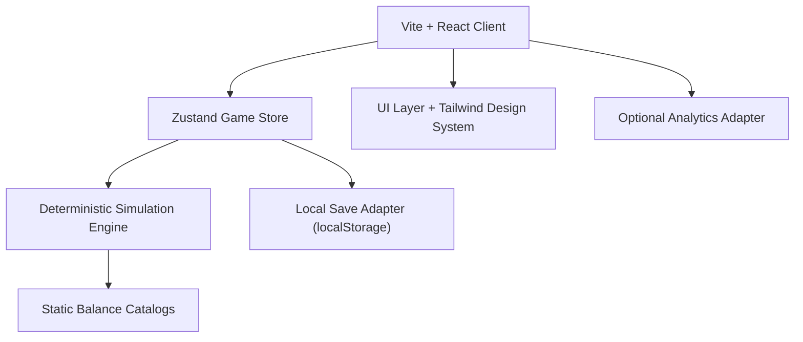

# PRD — Definitely Not Overfishing

## 1. Overview

### Product Summary
Definitely Not Overfishing is a free browser incremental where cozy manual fishing grows into an unsettling extraction empire. The MVP is a contained 75-90 minute experience designed for players who like the premise density of concept-first incrementals but want a full session arc instead of hollow number escalation. The product's core technical job is to make role changes, bottlenecks, and depletion easy to understand while the system grows more complex.

### Objective
This PRD covers the MVP defined in [product-vision.md](/Users/gregoryhochard/Development/overfishing/docs/product-vision.md): a first public browser prototype with manual fishing, multi-phase progression, stock depletion and scarcity pricing, passive gear, boats and maintenance, processing and contracts, regional extraction pressure, a Soft-to-Severe UI arc, local persistence, and a first License Renewal reset. It does not cover accounts, cloud saves, payments, or deep post-launch political systems.

### Market Differentiation
The implementation has to preserve one core differentiator: progression changes the player's job. Technically that means every phase must expose a new state surface, a new decision tension, and a visible shift in interface density or language. If the software only delivers more resources or more timers, it has missed the product strategy even if the math works.

### Magic Moment
The magic moment happens when the player realizes their best move is no longer to cast the line but to orchestrate labor, routes, and output. Technically, that means the game must reach Fleet Ops within a normal first session, automated systems must clearly outperform manual play for base income, and the UI must surface that new agency without hiding the consequences.

### Success Criteria
- Time to first satisfying upgrade: `< 3 minutes`
- Time to Phase 4 / Fleet Ops for engaged players: `25-45 minutes`
- Initial load to playable on desktop broadband: `< 2.5s`
- Save/load success rate in manual testing: `100%`
- All P0 systems functional with automated unit coverage for reducers/selectors and at least one end-to-end happy-path playthrough

## 2. Technical Architecture

### Architecture Overview
The MVP is a static client-side application. All simulation, progression, and persistence happen in the browser.



### Chosen Stack

| Layer | Choice | Rationale |
|---|---|---|
| Frontend | React + TypeScript + Vite | Fast iteration and low framework overhead for a UI-heavy browser game |
| Backend | None | Validate the game loop before adding server complexity |
| Database | None | Use browser-local persistence only for the prototype |
| Auth | None | Zero friction for first-time players |
| Payments | None | Revenue is intentionally deferred |

### Stack Integration Guide
Setup order matters because this project is state-heavy, not backend-heavy.

1. Initialize Vite with React and TypeScript.
2. Add Tailwind CSS, global design tokens, and the base app shell before any feature work.
3. Add Zustand plus Immer for state management and isolate simulation logic in pure functions under `src/lib/simulation/`.
4. Add Zod for save validation and migration guards.
5. Add the local save adapter and autosave debounce before building deep progression systems so balancing work survives refreshes.
6. Add analytics only after the playable loop exists. Gate analytics behind an environment flag.

Known integration gotchas:
- Do not drive progression from component-local timers. Use a single simulation tick source in the store and derive all downstream state.
- Do not let hidden-tab throttling break balance. On resume, calculate elapsed time from timestamps and advance the simulation in bounded chunks.
- Save writes must be debounced and versioned. A malformed save should fall back gracefully to a fresh run or a last-known-good snapshot.

Required environment variables:

```bash
VITE_APP_ENV=development
VITE_ENABLE_ANALYTICS=false
VITE_ANALYTICS_DOMAIN=
```

### Repository Structure

```text
project-root/
├── public/
│   ├── icons/                    # PWA/icon assets
│   └── audio/                    # Optional ambient stings
├── src/
│   ├── app/
│   │   ├── routes/
│   │   │   ├── LandingPage.tsx
│   │   │   ├── PlayPage.tsx
│   │   │   └── SettingsPage.tsx
│   │   ├── AppRouter.tsx
│   │   └── providers.tsx
│   ├── components/
│   │   ├── ui/                   # Buttons, cards, badges, meters, tabs
│   │   └── game/                 # Feature-assembled panels and modals
│   ├── features/
│   │   ├── fishing/
│   │   ├── upgrades/
│   │   ├── regions/
│   │   ├── gear/
│   │   ├── fleet/
│   │   ├── processing/
│   │   ├── contracts/
│   │   ├── prestige/
│   │   └── settings/
│   ├── lib/
│   │   ├── simulation/           # Deterministic tick/update logic
│   │   ├── economy/              # Balance formulas and calculators
│   │   ├── storage/              # Save adapter, migrations, validation
│   │   ├── analytics/            # Optional analytics wrapper
│   │   └── utils/
│   ├── styles/
│   │   ├── tokens.css
│   │   └── globals.css
│   ├── test/
│   │   ├── fixtures/
│   │   └── helpers/
│   ├── main.tsx
│   └── App.tsx
├── docs/
├── tailwind.config.ts
├── vite.config.ts
└── package.json
```

### Infrastructure & Deployment
Deploy as a static site on Vercel for the path of least resistance. Use `npm run build` to produce static assets and configure a single deploy target with preview deployments for branch work. Keep analytics optional; Vercel Analytics or Plausible can be added after the first private build.

Recommended CI steps:
- `npm run lint`
- `npm run test`
- `npm run build`

No server runtime is required for the MVP. If a feedback form is needed before backend work exists, link to an external form rather than embedding a new service dependency into the product.

### Security Considerations
This app has no authentication or server-side trust boundary, so security focuses on client safety and operational hygiene.

- Never trust imported or migrated save data without Zod validation.
- Do not embed secrets in the client bundle.
- Add a Content Security Policy that only allows self-hosted scripts/styles plus approved analytics if enabled.
- Treat all progression data as non-authoritative. Players can tamper with local saves; that is acceptable for a single-player prototype.
- Sanitize any externally sourced markdown or HTML if post-launch content systems are ever added.

### Cost Estimate
Monthly cost for the first six months should be near-zero:

| Service | Tier | Estimated Monthly Cost |
|---|---|---|
| Vercel static hosting | Hobby | `$0` |
| Domain | Annual | `~$1-2/month equivalent` |
| Analytics (optional) | Plausible/hosted or Vercel Analytics | `$0-9` |
| Error tracking (optional) | Sentry free tier | `$0` |

Estimated total: `$0-12/month`.

## 3. Data Model

### Entity Definitions
The MVP uses a versioned local save file backed by `localStorage`. The authoritative model is TypeScript, not SQL.

```typescript
type PhaseId =
  | "quietPier"
  | "skiffOperator"
  | "docksideGear"
  | "fleetOps"
  | "processingContracts"
  | "regionalExtraction";

type UiTone = "cozy" | "operational" | "industrial";

type RegionId = "pierCove" | "kelpBed" | "offshoreShelf";

interface SaveFile {
  version: 1;
  createdAt: string;
  lastSavedAt: string;
  meta: MetaProgressState;
  settings: SettingsState;
  run: RunState | null;
}

interface MetaProgressState {
  renewals: number;
  startingCashBonus: number;
  manualCatchBonus: number;
  unlockFlags: string[];
}

interface SettingsState {
  reducedMotion: boolean;
  uiScale: "default" | "large";
  soundEnabled: boolean;
  analyticsConsent: boolean;
}

interface RunState {
  phase: PhaseId;
  uiTone: UiTone;
  elapsedSeconds: number;
  cash: number;
  lifetimeRevenue: number;
  lifetimeFishLanded: number;
  manual: ManualFishingState;
  regions: Record<RegionId, RegionState>;
  gear: Record<string, GearState>;
  boats: Record<string, BoatState>;
  facilities: FacilityState;
  contracts: Record<string, ContractState>;
  resources: ResourceState;
  trust: number;
  influence: number;
  oceanHealth: number;
  unlocks: UnlockState;
  notifications: NotificationState[];
}

interface ManualFishingState {
  cooldownMs: number;
  perfectZoneWidth: number;
  catchAmountNormal: number;
  catchAmountPerfect: number;
  sellValueModifier: number;
}

interface RegionState {
  id: RegionId;
  label: string;
  stockCurrent: number;
  stockCap: number;
  regenPerSecond: number;
  baseFishValue: number;
  catchSpeedModifier: number;
  scarcityPriceModifier: number;
  bycatchRate: number;
  habitatDamage: number;
  unlocked: boolean;
}

interface GearState {
  id: string;
  kind: "crabPot" | "longline";
  assignedRegionId: RegionId;
  outputPerSecond: number;
  collectionIntervalSeconds: number;
  secondsSinceCollection: number;
  active: boolean;
}

interface BoatState {
  id: string;
  model: "rustySkiff" | "workSkiff";
  automated: boolean;
  assignedRegionId: RegionId | null;
  holdCap: number;
  holdCurrent: number;
  fuelCap: number;
  fuelCurrent: number;
  maintenancePercent: number;
  catchRatePerSecond: number;
  crewAssigned: boolean;
  wagePerMinute: number;
  breakdownUntilTimestamp?: number;
}

interface FacilityState {
  dockStorageCap: number;
  dockStorageRawFish: number;
  coldStorageCap: number;
  coldStorageRawFish: number;
  unloadLanes: number;
  flashFreezerEnabled: boolean;
  canneryEnabled: boolean;
  processingQueues: ProcessingQueueState[];
}

interface ProcessingQueueState {
  id: string;
  product: "frozenCrate" | "cannedCase";
  inputRequired: number;
  cycleSeconds: number;
  progressSeconds: number;
  active: boolean;
}

interface ContractState {
  id: string;
  type: "restaurant" | "grocer" | "schoolLunch";
  product: "frozenCrate" | "cannedCase";
  requiredAmount: number;
  deliveredAmount: number;
  rewardCash: number;
  expiresAtSeconds: number;
  status: "available" | "active" | "completed" | "expired";
}

interface ResourceState {
  fuel: number;
  rawFish: number;
  frozenCrates: number;
  cannedCases: number;
}

interface UnlockState {
  tabs: ("harbor" | "fleet" | "processing" | "regions" | "settings")[];
  upgrades: string[];
  phasesSeen: PhaseId[];
}

interface NotificationState {
  id: string;
  kind: "unlock" | "warning" | "breakdown" | "contract" | "renewal";
  message: string;
  createdAtSeconds: number;
}
```

### Relationships
- `SaveFile` has one `MetaProgressState`, one `SettingsState`, and zero or one active `RunState`.
- `RunState` owns all progression state for the current session. Resetting via License Renewal clears `RunState` but preserves `MetaProgressState`.
- `BoatState.assignedRegionId` and `GearState.assignedRegionId` reference `RegionState.id`.
- `ProcessingQueueState` consumes from `FacilityState.coldStorageRawFish` and produces inventory consumed by `ContractState`.
- `ContractState` depends on available processed goods and shares the run clock through `expiresAtSeconds`.

Cascades:
- Deleting a run deletes boats, contracts, facilities, and notifications together.
- Region references must be reassigned or nulled during any future migration that removes or renames a region.

### Indexes
There is no database, so "indexes" are implementation-level keyed maps and selectors:

- Store `regions`, `boats`, `gear`, and `contracts` as `Record<id, entity>` for O(1) updates.
- Maintain derived selectors for `activeBoatsByRegion`, `availableContracts`, `currentBottlenecks`, and `phaseProgress`.
- Keep balance catalog data in static maps keyed by upgrade, phase, boat model, and contract type.

## 4. API Specification

### API Design Philosophy
The MVP has no network API. Instead, all gameplay flows through a deterministic local command/query layer backed by the store. Commands mutate state through pure reducers plus a small orchestration layer for persistence and notifications. Queries are pure selectors that assemble UI-ready snapshots.

Error format for commands:

```typescript
type CommandResult<T> =
  | { ok: true; data: T }
  | { ok: false; error: "INVALID_STATE" | "INSUFFICIENT_FUNDS" | "CAPACITY_BLOCKED" | "LOCKED"; message: string };
```

### Endpoints

```typescript
query("game.getSnapshot", {
  args: {},
  returns: GameSnapshot,
  handler: () => currentStoreSnapshot
})

query("progress.getPhaseStatus", {
  args: {},
  returns: {
    currentPhase: PhaseId;
    progressToNextUnlock: number;
    bottlenecks: string[];
  },
  handler: () => selectPhaseStatus()
})

mutation("run.start", {
  args: { fresh: boolean },
  returns: { phase: PhaseId; cash: number },
  handler: (args) => startRun(args.fresh)
})

mutation("cast.perform", {
  args: { zoneHit: "normal" | "perfect"; nowMs: number },
  returns: {
    fishCaught: number;
    cashEarned: number;
    updatedStockPercent: number;
    nextCooldownMs: number;
  },
  handler: (args) => performCast(args)
})

mutation("upgrades.purchase", {
  args: { upgradeId: string },
  returns: { unlockedPhase?: PhaseId; newCashBalance: number },
  handler: (args) => purchaseUpgrade(args.upgradeId)
})

mutation("gear.collect", {
  args: { gearId: string },
  returns: { rawFishCollected: number; storageBlocked: boolean },
  handler: (args) => collectGear(args.gearId)
})

mutation("boats.assignRoute", {
  args: { boatId: string; regionId: RegionId; automated: boolean; crewAssigned: boolean },
  returns: { catchRatePerSecond: number; fuelDrainPerTrip: number },
  handler: (args) => assignBoatRoute(args)
})

mutation("boats.repair", {
  args: { boatId: string },
  returns: { maintenancePercent: number; cashSpent: number },
  handler: (args) => repairBoat(args.boatId)
})

mutation("processing.setQueue", {
  args: { queueId: string; active: boolean; product: "frozenCrate" | "cannedCase" },
  returns: { queueState: ProcessingQueueState },
  handler: (args) => setProcessingQueue(args)
})

mutation("contracts.accept", {
  args: { contractId: string },
  returns: { expiresAtSeconds: number },
  handler: (args) => acceptContract(args.contractId)
})

mutation("contracts.claimReward", {
  args: { contractId: string },
  returns: { cashRewarded: number; status: "completed" },
  handler: (args) => claimContractReward(args.contractId)
})

mutation("meta.renewLicense", {
  args: {},
  returns: { renewals: number; carryoverBonuses: MetaProgressState },
  handler: () => renewLicense()
})

mutation("settings.update", {
  args: { patch: Partial<SettingsState> },
  returns: SettingsState,
  handler: (args) => updateSettings(args.patch)
})
```

## 5. User Stories

### Epic: First Session Onboarding

**US-001: Start A New Run**
As Jordan, I want to begin playing immediately so that the concept hooks me before friction does.

Acceptance Criteria:
- [ ] Given I open the game for the first time, when I click play, then I land in the dock view within one interaction.
- [ ] Given no save exists, when I start a run, then the game seeds default starting values and shows the manual cast tutorial.
- [ ] Edge case: if a corrupted save exists, the game offers a safe reset instead of crashing.

**US-002: Learn The Manual Loop**
As Jordan, I want the first few minutes to teach themselves so that I understand how money, stock, and upgrades relate.

Acceptance Criteria:
- [ ] Given I cast normally, when the action resolves, then I receive fish and immediate cash feedback.
- [ ] Given I hit the perfect zone, when the cast resolves, then I get a larger reward and stronger feedback.
- [ ] Edge case: if stock is depleted, the UI shows why catches slowed without blocking play entirely.

### Epic: Phase Progression

**US-003: Unlock New Management Layers**
As Miles, I want each phase to add a new tension so that progression feels like evolution rather than inflation.

Acceptance Criteria:
- [ ] Given I meet unlock thresholds, when a new phase begins, then the game surfaces the new system and its tension clearly.
- [ ] Given a phase unlock happens, when I dismiss the modal, then the relevant tab or panel becomes available.
- [ ] Edge case: if I cross multiple thresholds at once, the game resolves unlocks in order without losing state.

### Epic: Passive Gear And Fleet Management

**US-004: Run Passive Gear**
As Jordan, I want passive systems to supplement manual play so that I feel my role expanding.

Acceptance Criteria:
- [ ] Given I own passive gear, when time advances, then it generates catch into storage according to its rate.
- [ ] Given storage is full, when passive gear would produce more, then production pauses and a bottleneck warning appears.
- [ ] Edge case: if gear goes uncollected without the helper upgrade, output pauses on schedule.

**US-005: Operate Boats And Crew**
As Miles, I want to assign boats to regions and maintain them so that the game becomes operational rather than purely manual.

Acceptance Criteria:
- [ ] Given I own an automated boat, when I assign it to a region, then catch, fuel, and maintenance all update over time.
- [ ] Given maintenance drops below thresholds, when I continue operating, then penalties and breakdown risk apply.
- [ ] Edge case: if fuel or hold capacity is exhausted mid-loop, the boat stops producing and surfaces the reason.

### Epic: Processing And Contracts

**US-006: Convert Catch Into Products**
As Avery, I want catch to flow through storage and processing so that the tycoon layer feels real.

Acceptance Criteria:
- [ ] Given raw fish enters cold storage, when a processing line is active, then input is consumed and products are created on cadence.
- [ ] Given unload or storage caps are reached, when boats return, then output backs up visibly instead of disappearing.
- [ ] Edge case: if a player disables a line mid-cycle, the partial progress rule is consistent and communicated.

**US-007: Complete Timed Contracts**
As Jordan, I want contracts to shape short-term priorities so that mid-game decisions feel tense.

Acceptance Criteria:
- [ ] Given I accept a contract, when I deliver enough product before the timer ends, then I can claim the reward.
- [ ] Given a contract expires, when time runs out, then the contract fails cleanly and returns to the board if appropriate.
- [ ] Edge case: if I have the product inventory before accepting, delivery still requires an explicit action.

### Epic: Regional Extraction And Reset

**US-008: See Depletion Become Profitable**
As Jordan, I want region stock and price signals to react to extraction so that the satire emerges from play.

Acceptance Criteria:
- [ ] Given region stock falls, when I inspect the region, then I see slower catches and higher scarcity pricing together.
- [ ] Given bycatch or habitat damage rises, when the extraction layer unlocks, then trust and ocean health reflect it.
- [ ] Edge case: if multiple regions degrade simultaneously, the UI still makes the current bottleneck legible.

**US-009: Renew The License**
As Miles, I want the first reset to feel like closure and a reason to start again so that the session has a satisfying endpoint.

Acceptance Criteria:
- [ ] Given I reach the renewal threshold, when I open the renewal modal, then I see clear carryover bonuses and summary stats.
- [ ] Given I confirm renewal, when the reset completes, then the run state clears and meta progression remains.
- [ ] Edge case: if the player cancels renewal, they can return to the current run without state loss.

## 6. Functional Requirements

**FR-001: Public Landing Page**
Priority: P0
Description: Provide a landing page at `/` with the one-line pitch, browser-play CTA, and a concise explanation of the cozy-to-industrial arc.
Acceptance Criteria:
- Play CTA routes to `/play`
- Landing page loads without requiring a save
- Copy and visuals reflect the warm early-game tone
Related Stories: US-001

**FR-002: Manual Fishing Interaction**
Priority: P0
Description: Implement the timing-based manual cast loop with normal and perfect outcomes, cooldown handling, and immediate cash feedback.
Acceptance Criteria:
- Normal and perfect catches have distinct outcomes
- Cooldown is visible and enforced
- Catch resolution updates stock and cash atomically
Related Stories: US-002

**FR-003: Stock Pressure And Scarcity Pricing**
Priority: P0
Description: Every region must calculate catch-speed modifiers and scarcity-price modifiers from current stock.
Acceptance Criteria:
- Catch-speed thresholds match the design tables
- Price multipliers increase when stock falls
- UI shows both current stock and resulting modifier state
Related Stories: US-002, US-008

**FR-004: Upgrade Shop And Phase Unlocks**
Priority: P0
Description: Implement purchasable upgrades, threshold checks, and phase unlock presentation.
Acceptance Criteria:
- Upgrades can be purchased only when affordable
- Unlock checks run after each relevant state change
- Phase unlocks trigger once and persist in save data
Related Stories: US-003

**FR-005: Boat Trips And Resource Constraints**
Priority: P0
Description: Implement skiff/boat operations with fuel, hold capacity, and region-based yield.
Acceptance Criteria:
- Boats consume fuel per trip or route cycle
- Hold limits cap production until unload
- Region selection changes value and production rates
Related Stories: US-005

**FR-006: Passive Gear**
Priority: P0
Description: Implement passive gear slots, output rates, collection windows, and helper automation.
Acceptance Criteria:
- Passive gear produces on tick
- Uncollected gear pauses on schedule when required
- Output routes into storage and obeys storage caps
Related Stories: US-004

**FR-007: Storage Decay And Bottlenecks**
Priority: P0
Description: Dock storage, cold storage, and unload throughput must create visible bottlenecks and decay rules.
Acceptance Criteria:
- Dock storage decays raw fish by configured intervals
- Cold storage prevents decay
- Full storage pauses upstream systems instead of dropping resources
Related Stories: US-004, US-006

**FR-008: Fleet Automation And Maintenance**
Priority: P0
Description: Automated boats must earn passively while consuming wages, maintenance, and fuel.
Acceptance Criteria:
- Automated catch rates differ by boat and region
- Maintenance thresholds apply penalties and breakdown chances
- Repair actions restore maintenance and consume cash/time
Related Stories: US-005

**FR-009: Processing Lines**
Priority: P0
Description: Convert raw fish into frozen crates and canned cases with queue-based processing lines.
Acceptance Criteria:
- Lines consume input only when active and sufficiently stocked
- Products are added to inventory on cycle completion
- Queue state persists through saves
Related Stories: US-006

**FR-010: Contract Board**
Priority: P0
Description: Provide timed contracts with acceptance, progress, expiry, and reward claim flows.
Acceptance Criteria:
- Contracts expose requirements, timer, and reward
- Accepted contracts progress from deliveries only
- Expired contracts fail cleanly and update status
Related Stories: US-007

**FR-011: Regional Extraction Dashboard**
Priority: P0
Description: Expose region stock bars, bycatch, habitat damage, trust, and ocean health during the final phase.
Acceptance Criteria:
- Regions tab unlocks in the final phase
- Stock and scarcity signals are visible at a glance
- Trust and ocean health change from extraction outcomes
Related Stories: US-008

**FR-012: UI Tone Shift**
Priority: P1
Description: The visual system must tighten and cool as phases advance.
Acceptance Criteria:
- Theme tokens can switch by phase band
- Late-game panels use operational copy and denser layouts
- The shift is progressive, not a single hard swap
Related Stories: US-003, US-008

**FR-013: License Renewal Reset**
Priority: P0
Description: Add a first prestige/reset loop with summary, carryover bonuses, and clean state reset.
Acceptance Criteria:
- Renewal threshold is gated by first-run completion rules
- Summary modal shows run outcome and bonuses
- Reset preserves meta progression only
Related Stories: US-009

**FR-014: Local Persistence**
Priority: P0
Description: Autosave all relevant run and settings state to browser storage with versioning.
Acceptance Criteria:
- Save writes occur on a debounce plus before unload
- Save schema is versioned and validated
- Corrupt saves fall back safely
Related Stories: US-001, US-009

**FR-015: Settings And Accessibility Controls**
Priority: P1
Description: Add settings for reduced motion, UI scale, sound, and analytics consent.
Acceptance Criteria:
- Settings page or modal is reachable from the main shell
- Changes persist across reloads
- Reduced motion affects major animations
Related Stories: US-001

**FR-016: Analytics Hooks**
Priority: P1
Description: Add optional instrumentation for session start, phase reach, License Renewal, and feedback CTA clicks.
Acceptance Criteria:
- Analytics are disabled by default in local development
- Events fire once per milestone
- No gameplay depends on analytics availability
Related Stories: US-001, US-003, US-009

## 7. Non-Functional Requirements

### Performance
- Initial JS payload target: `< 250KB gzipped` before optional audio
- First contentful paint on desktop broadband: `< 1.5s`
- Time to interactive: `< 2.5s`
- Average simulation tick cost during active play: `< 8ms`
- Autosave write path: `< 50ms` per write

### Security
- No runtime secrets in the client
- CSP configured for self-hosted assets plus optional analytics domain
- Save import/migration payloads validated with Zod before use
- No use of `dangerouslySetInnerHTML` without sanitization

### Accessibility
- WCAG 2.1 AA for all core screens
- Full keyboard navigation for manual fishing, shop, tabs, and modals
- Visible focus ring with at least `2px` contrast-compliant outline
- Reduced motion mode disables non-essential transforms and pulsing alerts

### Scalability
- Support at least `50,000` anonymous monthly players on static hosting without architecture changes
- Support at least `5,000` concurrent static asset requests via CDN-backed hosting
- Simulation performance must not degrade materially with a fully unlocked MVP save

### Reliability
- Autosave on a 15-second debounce plus on unload and milestone unlocks
- Versioned save migrations for any future schema changes
- Corrupt-save recovery path must preserve settings and offer fresh run reset
- Target effective uptime: `99.5%` assuming static host availability

## 8. UI/UX Requirements

### Screen: Landing
Route: `/`
Purpose: Introduce the concept and move players into the game quickly.
Layout: Hero headline, short supporting copy, browser-play CTA, feature strip, and an optional "How the session works" section below the fold.

States:
- **Empty:** N/A
- **Loading:** Minimal shell skeleton only if fonts or assets are delayed
- **Populated:** Hero, screenshots/GIF strip, CTA, and footer
- **Error:** Fallback text-only CTA if asset loading fails

Key Interactions:
- Click `Play in browser` -> route to `/play` -> initialize or resume run
- Click `How it works` -> scroll to first-session explanation

Components Used: `HeroButton`, `FeatureCard`, `SectionHeading`, `InlineBadge`

### Screen: Play Shell
Route: `/play`
Purpose: Main game surface for all gameplay systems.
Layout: Top status rail, left primary action/overview column, center active panel area, right tabbed operations rail. On smaller screens, collapse into stacked sections with sticky resource summary.

States:
- **Empty:** Fresh-run onboarding overlay with first cast guidance
- **Loading:** Save restore skeleton for panels and resource rail
- **Populated:** Active phase panel, shop/actions, tab rail, notifications, modal mount point
- **Error:** Save-load recovery prompt with reset option

Key Interactions:
- Trigger manual cast -> resolve timing outcome -> update resources and stock
- Purchase upgrade -> spend cash -> unlock new capacity or phase
- Switch operation tab -> reveal relevant system panel without route change

Components Used: `StatusRail`, `CastButton`, `MeterCard`, `UpgradeCard`, `OperationTabs`, `ToastStack`

### Screen: Contracts Drawer
Route: `/play` (drawer/modal)
Purpose: Accept, track, and claim timed contracts.
Layout: Slide-over drawer with available contracts list, active contract card, reward summaries, and timer readouts.

States:
- **Empty:** Explain that contracts unlock after processing is online
- **Loading:** Skeleton cards
- **Populated:** Available and active contract cards with progress bars
- **Error:** Retry state if contract action handler returns error

Key Interactions:
- Accept contract -> lock contract -> start timer
- Claim reward -> grant cash -> archive completed contract

Components Used: `Drawer`, `ContractCard`, `ProgressBar`, `Badge`

### Screen: Regions Panel
Route: `/play` (tab content)
Purpose: Show depletion, scarcity, bycatch, trust, and health pressure during the late game.
Layout: Multi-card table/grid of regions with stock bars on the left and consequence summary on the right.

States:
- **Empty:** "Regional oversight unlocks once your fleet expands offshore."
- **Loading:** Skeleton rows
- **Populated:** Region cards with stock, price, travel profile, and damage indicators
- **Error:** Inline warning banner and stale data notice

Key Interactions:
- Select region card -> highlight route implications -> surface bottlenecks
- Hover or focus metric -> reveal explanation tooltip

Components Used: `RegionCard`, `StackedMeter`, `Tooltip`, `InlineTelemetry`

### Screen: License Renewal Modal
Route: `/play` (modal)
Purpose: End the first run and apply light meta progression.
Layout: Center modal with run summary, damage summary, carryover bonuses, and confirm/cancel actions.

States:
- **Empty:** Hidden until unlocked
- **Loading:** N/A
- **Populated:** Summary metrics, bonus preview, confirm action
- **Error:** Block confirm and show retry message if save write fails

Key Interactions:
- Confirm renewal -> persist meta -> reset run -> route stays on `/play`
- Cancel -> return to game unchanged

Components Used: `Modal`, `SummaryRow`, `PrimaryButton`, `SecondaryButton`

### Screen: Settings
Route: `/settings`
Purpose: Let players adjust presentation and consent preferences without cluttering the main shell.
Layout: Simple stacked settings page or modal with toggles, sliders, and links.

States:
- **Empty:** N/A
- **Loading:** Current settings placeholder
- **Populated:** Toggles for reduced motion, sound, analytics consent, UI scale
- **Error:** Inline message if a preference write fails

Key Interactions:
- Toggle reduced motion -> update animation behavior globally
- Adjust UI scale -> update root font sizing and layout density

Components Used: `ToggleRow`, `SelectField`, `PageHeader`, `TextButton`

## 9. Design System

### Color Tokens

```css
:root {
  --color-primary: #8a502f;
  --color-primary-hover: #6e3e24;
  --color-secondary: #416568;
  --color-accent: #2ddbde;
  --color-background: #fef9ef;
  --color-surface: #f3ede0;
  --color-surface-raised: #ffffff;
  --color-industrial: #0f222d;
  --color-text: #2f281f;
  --color-text-muted: #625f53;
  --color-border: #b6b2a3;
  --color-success: #3a8f68;
  --color-warning: #ffbf00;
  --color-error: #ee7d77;
}
```

### Typography Tokens

```css
@import url("https://fonts.googleapis.com/css2?family=IBM+Plex+Mono:wght@500&family=Plus+Jakarta+Sans:wght@400;500;600&family=Space+Grotesk:wght@500;600;700&display=swap");

:root {
  --font-heading: "Space Grotesk", sans-serif;
  --font-body: "Plus Jakarta Sans", sans-serif;
  --font-mono: "IBM Plex Mono", monospace;
  --text-xs: 0.75rem;
  --text-sm: 0.875rem;
  --text-base: 1rem;
  --text-lg: 1.125rem;
  --text-xl: 1.25rem;
  --text-2xl: 1.5rem;
  --text-3xl: 1.875rem;
  --text-4xl: 2.5rem;
}
```

### Spacing Tokens

```css
:root {
  --space-4: 4px;
  --space-8: 8px;
  --space-12: 12px;
  --space-16: 16px;
  --space-24: 24px;
  --space-32: 32px;
  --space-48: 48px;
  --space-64: 64px;
}
```

### Component Specifications
- **Button:** early primary buttons use `24px` radius, warm gradient background, `16px 24px` padding, and `160ms` transitions. Late operational buttons can tighten to `12px` radius with flatter fills.
- **Card:** default card background `var(--color-surface)` with `16px` radius and ambient shadow `0 20px 40px rgba(138, 80, 47, 0.06)`. Industrial cards switch to `var(--color-industrial)` and remove heavy shadow.
- **Meter:** use stacked bar fills with text label and numeric delta. Never rely on color alone to convey danger.
- **Modal/Drawer:** `24px` radius early, `12px` radius late. Use blurred backdrop only for major phase or renewal moments, not every interaction.
- **Tabs:** pill-style early, tighter segmented control late. Active state always needs icon + label, not icon only.

### Tailwind Configuration

```typescript
import type { Config } from "tailwindcss";

export default {
  content: ["./index.html", "./src/**/*.{ts,tsx}"],
  theme: {
    extend: {
      colors: {
        primary: "var(--color-primary)",
        "primary-hover": "var(--color-primary-hover)",
        secondary: "var(--color-secondary)",
        accent: "var(--color-accent)",
        background: "var(--color-background)",
        surface: "var(--color-surface)",
        "surface-raised": "var(--color-surface-raised)",
        industrial: "var(--color-industrial)",
        text: "var(--color-text)",
        "text-muted": "var(--color-text-muted)",
        border: "var(--color-border)",
        success: "var(--color-success)",
        warning: "var(--color-warning)",
        error: "var(--color-error)"
      },
      fontFamily: {
        heading: ["var(--font-heading)"],
        body: ["var(--font-body)"],
        mono: ["var(--font-mono)"]
      },
      spacing: {
        1: "var(--space-4)",
        2: "var(--space-8)",
        3: "var(--space-12)",
        4: "var(--space-16)",
        6: "var(--space-24)",
        8: "var(--space-32)",
        12: "var(--space-48)",
        16: "var(--space-64)"
      },
      borderRadius: {
        sm: "8px",
        xl: "16px",
        "2xl": "24px"
      },
      boxShadow: {
        soft: "0 20px 40px rgba(138, 80, 47, 0.06)"
      }
    }
  },
  plugins: []
} satisfies Config;
```

## 10. Auth Implementation
This app does not require authentication. If auth is added later, revisit this section and introduce it only after there is clear demand for cross-device saves or account-based progression.

## 11. Payment Integration
Payment integration is intentionally omitted from the MVP because the revenue model is free and the first goal is concept validation, not monetization.

## 12. Edge Cases & Error Handling

### Feature: Manual Fishing
| Scenario | Expected Behavior | Priority |
|---|---|---|
| Player clicks cast during cooldown | Ignore action and show cooldown feedback | P0 |
| Region stock is near zero | Apply slow catch modifier and explanatory tooltip | P0 |
| Save restores mid-cooldown | Recompute remaining cooldown from timestamp | P1 |

### Feature: Passive Gear And Fleet
| Scenario | Expected Behavior | Priority |
|---|---|---|
| Dock storage is full | Pause passive generation and show bottleneck notice | P0 |
| Boat maintenance hits breakdown threshold | Boat goes offline for configured duration and surfaces repair action | P0 |
| Fuel runs out mid-route | Boat returns to idle with explicit `Out of fuel` state | P0 |

### Feature: Processing And Contracts
| Scenario | Expected Behavior | Priority |
|---|---|---|
| Processing line lacks input | Queue pauses without losing partial configuration | P0 |
| Contract expires during page inactivity | Recompute against elapsed time on resume and mark expired if needed | P0 |
| Player claims contract reward twice | Second claim is rejected safely | P1 |

### Feature: Persistence
| Scenario | Expected Behavior | Priority |
|---|---|---|
| Save blob is malformed | Show recovery prompt and offer fresh run | P0 |
| localStorage quota error occurs | Warn player and disable autosave gracefully | P1 |
| App version changes | Run migration or invalidate stale save with explanation | P0 |

### Feature: License Renewal
| Scenario | Expected Behavior | Priority |
|---|---|---|
| Player opens renewal modal before requirements are met | Modal remains locked and explains remaining criteria | P1 |
| Save write fails during renewal | Abort reset and preserve run | P0 |
| Player cancels renewal | Return to current run unchanged | P0 |

## 13. Dependencies & Integrations

### Core Dependencies

```json
{
  "react": "latest",
  "react-dom": "latest",
  "zustand": "latest",
  "immer": "latest",
  "zod": "latest",
  "clsx": "latest",
  "tailwind-merge": "latest",
  "lucide-react": "latest",
  "framer-motion": "latest"
}
```

### Development Dependencies

```json
{
  "vite": "latest",
  "typescript": "latest",
  "tailwindcss": "latest",
  "postcss": "latest",
  "autoprefixer": "latest",
  "eslint": "latest",
  "prettier": "latest",
  "vitest": "latest",
  "@testing-library/react": "latest",
  "@testing-library/user-event": "latest",
  "jsdom": "latest",
  "@playwright/test": "latest"
}
```

### Third-Party Services
- **Vercel:** static hosting and preview deployments. Use hobby tier initially. No API key required for runtime.
- **Plausible or Vercel Analytics (optional):** lightweight milestone tracking. Requires opt-in domain/config only if enabled.
- **Sentry (optional):** client error reporting if post-launch debugging becomes necessary. Free tier is sufficient early.

## 14. Out of Scope
- Accounts and cloud saves: excluded because they do not improve the first-run arc; reconsider only after demand for cross-device continuity appears.
- Monetization: excluded until the prototype proves completion and recommendation value.
- Live-service cadence and daily systems: excluded because they shift focus from session design to retention mechanics.
- Deep policy/lobbying gameplay: excluded because the core extraction satire should land before broader governance systems are added.
- Native mobile optimization: excluded for MVP; responsive desktop-first web is enough.

## 15. Open Questions
1. **Should the prototype support portrait/mobile browsers at launch?**  
Tradeoff: broader reach versus more layout and interaction complexity.  
Recommended default: support tablet and landscape mobile tolerably, but optimize for desktop first.

2. **Should there be audio in v1?**  
Tradeoff: stronger mood versus extra polish scope.  
Recommended default: ship with minimal toggleable ambient audio only if it does not delay the playable build.

3. **Should save import/export ship in the first public version?**  
Tradeoff: useful for testers and balancing versus extra state-management surface.  
Recommended default: defer until after soft launch unless save corruption becomes a real issue.

4. **How explicit should the late-game extraction language become?**  
Tradeoff: stronger satire versus losing restraint.  
Recommended default: stay in dry corporate optimism and let metrics carry the discomfort.

5. **How much ocean-health pressure is enough for v1?**  
Tradeoff: richer consequence system versus late-game complexity creep.  
Recommended default: show trust, bycatch, and ocean-health decline clearly, but keep them as pressure signals rather than fully branching fail states.

